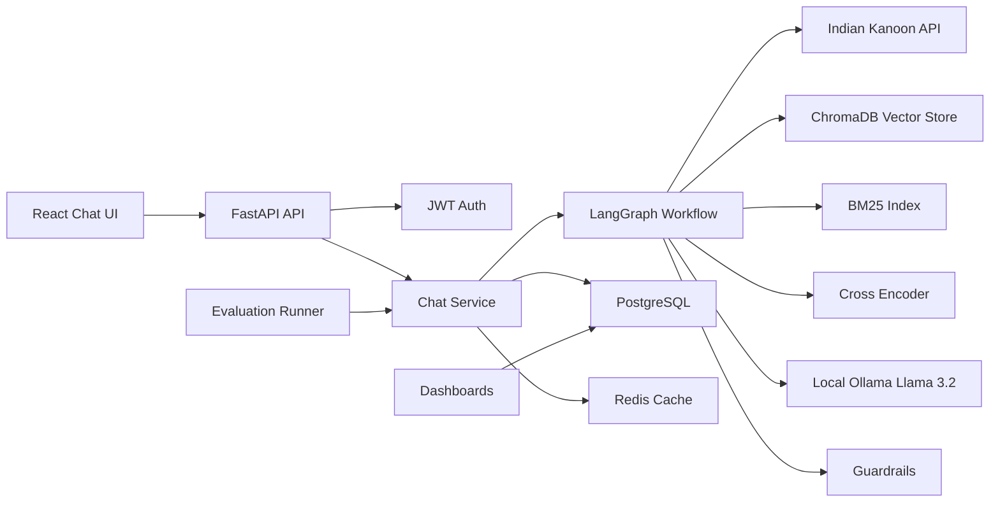
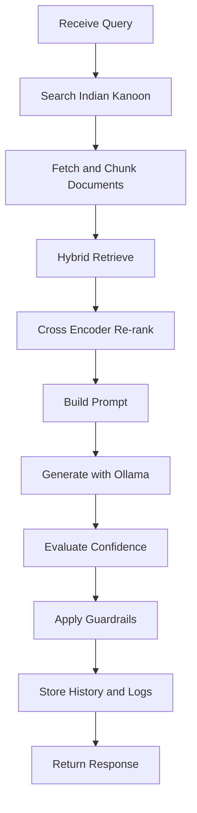

# Architecture

## Folder Hierarchy

```text
backend/
  app/
    api/v1/routers/        FastAPI route modules
    ai/                    RAG, LangGraph, prompt, retrieval, guardrails
    core/                  settings, security, errors, logging
    db/                    async SQLAlchemy session and base metadata
    integrations/          Indian Kanoon and Ollama clients
    middleware/            request IDs, metrics, structured logging
    models/                SQLAlchemy models
    repositories/          repository pattern over persistence
    schemas/               Pydantic request/response contracts
    services/              application service layer
frontend/
  src/
    api/                   Axios clients and query hooks
    components/            reusable UI components
    pages/                 routed pages
evaluation/                labeled dataset and reports
load_tests/                Locust scenarios
docs/                      implementation and operating docs
```

## Component Diagram



## Backend Architecture

The backend follows clean architecture boundaries. Routers validate HTTP contracts and call services. Services coordinate business use cases and depend on repositories or infrastructure clients through dependency functions. Repositories own database access and keep SQLAlchemy details out of API code. AI modules are pure orchestration units where practical, which makes retrieval, confidence, and guardrail behavior testable.

## Frontend Architecture

React pages are route-level views. Components are split into layout, chat, common controls, and dashboards. React Query owns server-state caching and streaming lifecycle flags. Axios centralizes credentials, timeouts, and error handling. TailwindCSS provides a compact operational interface rather than a marketing landing page.

## LangGraph Architecture



LangGraph is used because the legal QA path is a stateful workflow with explicit evidence, generation, verification, and refusal transitions. Every node receives and returns typed state, making the graph auditable and easy to evaluate.

## Database Schema

- `users`: authenticated users and roles.
- `chat_history`: immutable query, answer, confidence, citations, and refusal state.
- `search_logs`: Indian Kanoon requests, cache hits, latency, and result counts.
- `feedback`: user quality signals for responses.
- `evaluation_results`: benchmark query scores and guardrail outcomes.
- `metrics`: operational counters and latency samples.
- `guardrail_logs`: individual guardrail triggers and reasons.
- `documents`: normalized legal documents fetched from Indian Kanoon.
- `embeddings_metadata`: chunk-level metadata and Chroma vector identifiers.

## Redis Usage

Redis stores Indian Kanoon responses, document fetches, short-lived chat stream buffers, rate-limit counters, and health probe cache markers. Cached legal evidence is versioned by URL and query parameters to avoid stale key collisions.

## RAG Pipeline

The RAG pipeline searches Indian Kanoon, fetches top documents, strips HTML safely, chunks text with overlap, embeds chunks using Sentence Transformers, stores chunks in ChromaDB, retrieves with dense vectors plus BM25, re-ranks with a cross encoder, builds a citation-tagged context, asks Ollama to answer only from evidence, and verifies that cited IDs exist in the retrieved context.

## API Design

The API exposes health, auth, chat, streaming chat, search, documents, history, feedback, evaluation, admin metrics, and guardrail logs. Contracts are Pydantic models and errors are returned as structured `code/message/details` payloads.

## Guardrail Architecture

Guardrails run before and after generation. Pre-generation checks detect unsafe intent and personal legal-advice requests. Post-generation checks verify citation coverage, confidence, unsupported claims, future predictions, and domain-specific risk. Any trigger replaces the answer with the escalation message and logs the reason.

## Evaluation Architecture

The evaluation runner executes 100 labeled legal queries, stores per-query metrics, and computes citation accuracy, retrieval precision, recall, faithfulness, latency, hallucination rate, and context recall. The frontend dashboard reads these results for human review.

## Deployment Architecture

Docker Compose runs PostgreSQL, Redis, Ollama, FastAPI, and the Vite-built frontend behind nginx. GitHub Actions runs linting, backend tests, frontend tests, and Docker image builds. Alembic migrations are applied as a release step.

